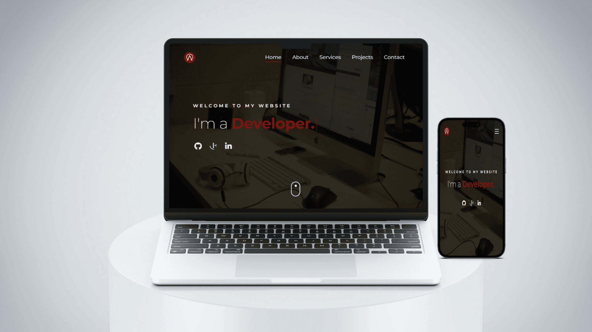

<h3 align="center">My Portfolio Website</h3>

  <a href="https://alessandracasole-dev.com"><strong>View Demo »</strong></a>

<!-- TABLE OF CONTENTS -->

  
Table of Contents

  <ol>
    <li>
      <a href="#overview">Overview</a>
      <ul>
        <li><a href="#about-the-project">About The Project</a></li>
        <li><a href="#links">Links</a></li>
      </ul>
    </li>
    <li>
      <a href="#my-process">My Process</a>
      <ul>
        <li><a href="#built-with">Built With</a></li>
      </ul>
    </li>
    <li><a href="#author">Author</a></li>
  </ol>

## Overview

### About the project

This is the first project carried out during the start2impact University course in Front End Development. 

It consists of the creation of a personal website in which to show one's personality, passions and skills in web development.

### Links

- Preview Site: [alessandracasole-dev.com](https://alessandracasole-dev.com/)
- View Code: [github.com/alessandra-casole/alessandra-casole.github.io](https://github.com/alessandra-casole/alessandra-casole.github.io)

## My process

### Built with

- Semantic HTML5 markup
- CSS custom properties
- Flexbox
- SASS
- Mobile-first workflow
- Media Queries
- Bootstrap
- JavaScript

- EmailJS
- Typed.js
- Scroll Reveal
- Isotope.pkgd

## Author

- Linkedin - [Alessandra Casole](https://www.linkedin.com/in/alessandracasole/)
